# UASWeb
## Membuat Web Sederhana

### Data 
Nama : Desvi Ramadhani Syafitri
NIM : 312110082
Kelas : TI.21.B.1
Disini Saya membuat website sederhana tentang kebersihan toilet menggunakan php, hal pertama yang dilakukan adalah membuat database dan jangan lupa menghidupkan xampp

### Membuat Koneksi
membuat koneksi dengan database yang ada di phpmyadmin sebagai berikut:
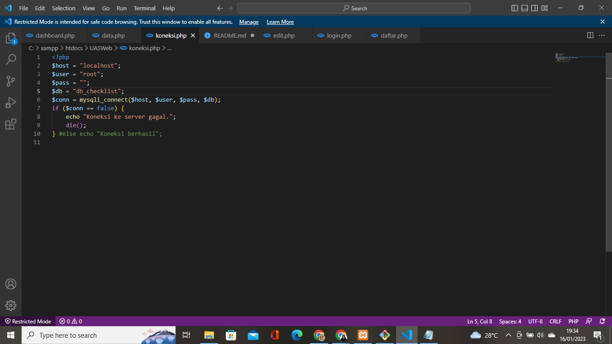

### Halaman Login
ini adalah kode dan hasil halaman login yang saya buat
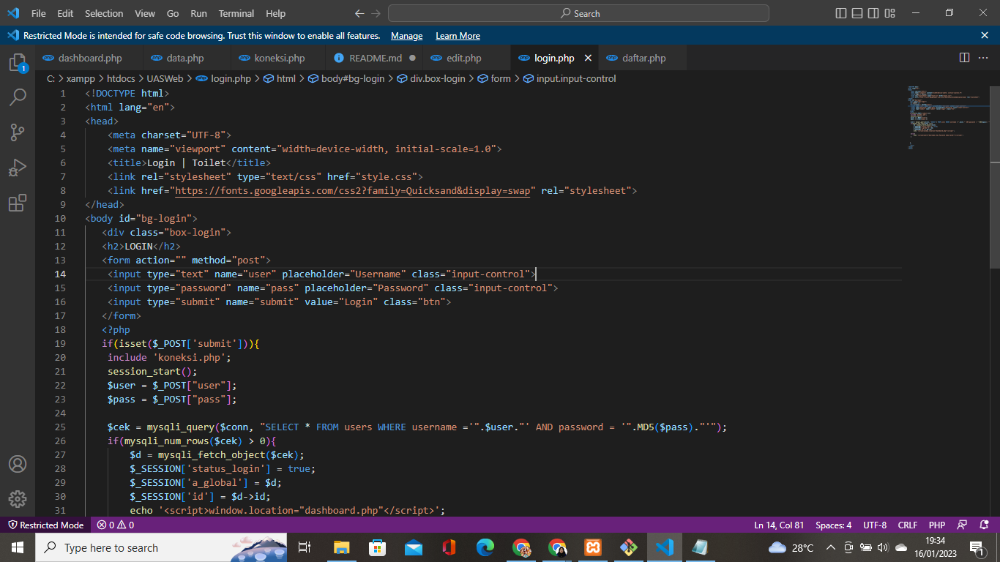
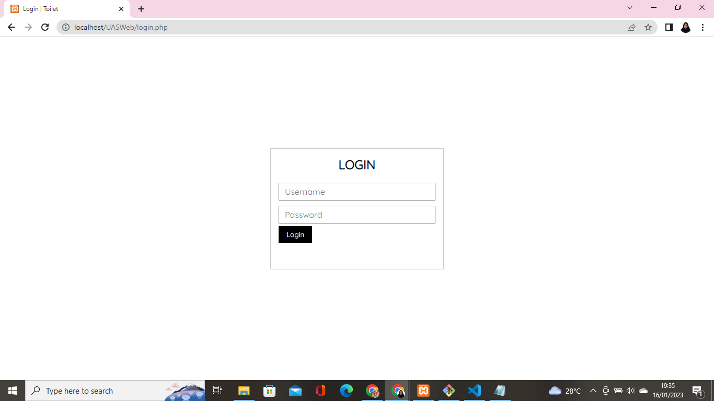

### Halaman Dashboard
ini adalah kode dan tampilannya:
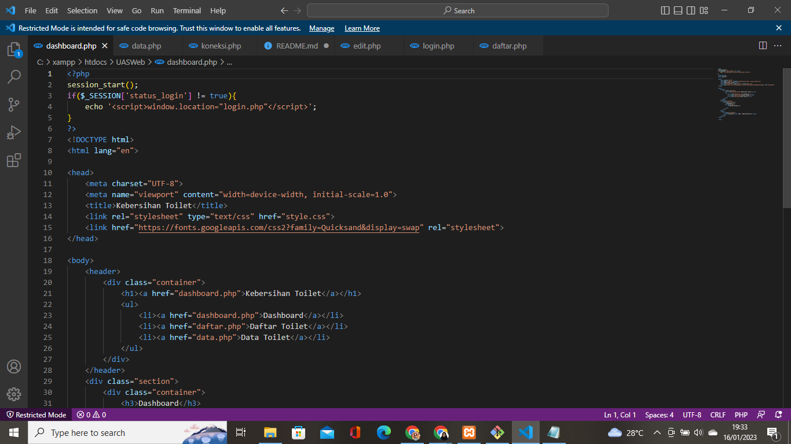
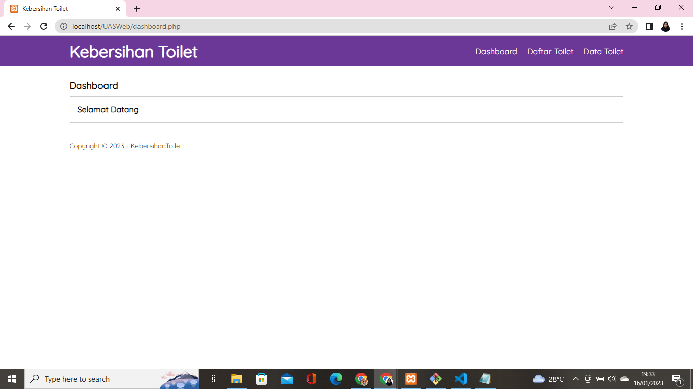

### Halaman Tampilan Data Toilet
Ini adalah kode dan tampilannya:
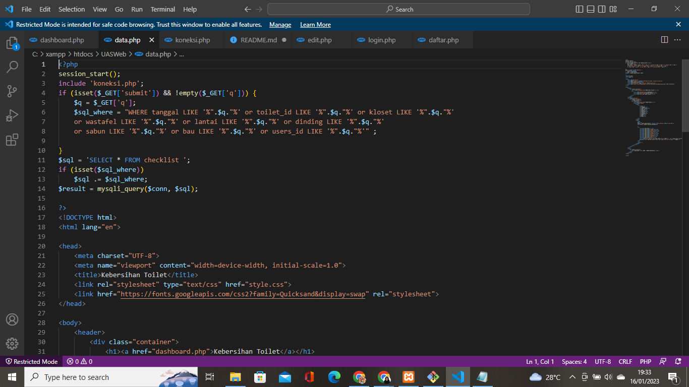
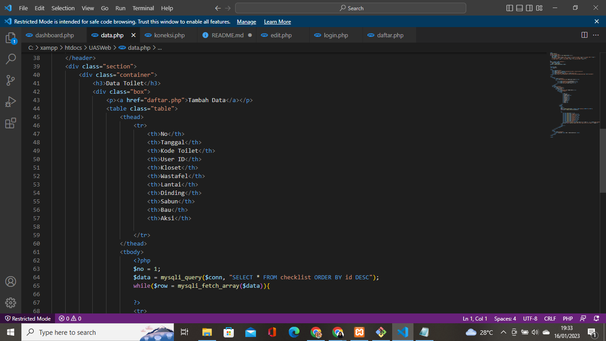

### Halaman Daftar Toilet
Ini adalah kode dan tampilan dari halaman daftar toilet:
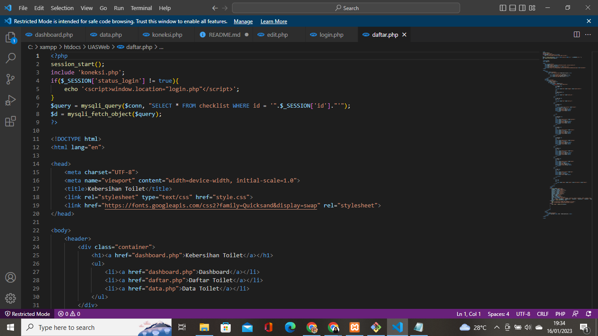
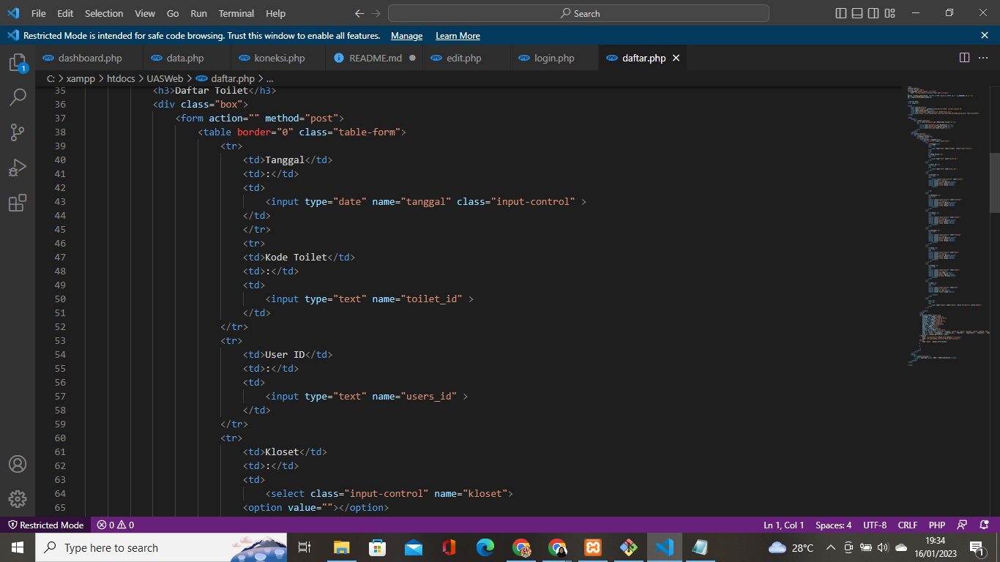
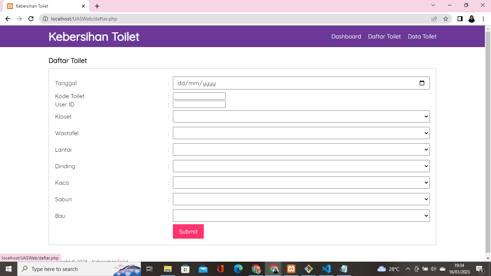

### Edit
ini adalah kode untuk kita meng edit atau ingin mengubah data yang kita input ke data toilet:
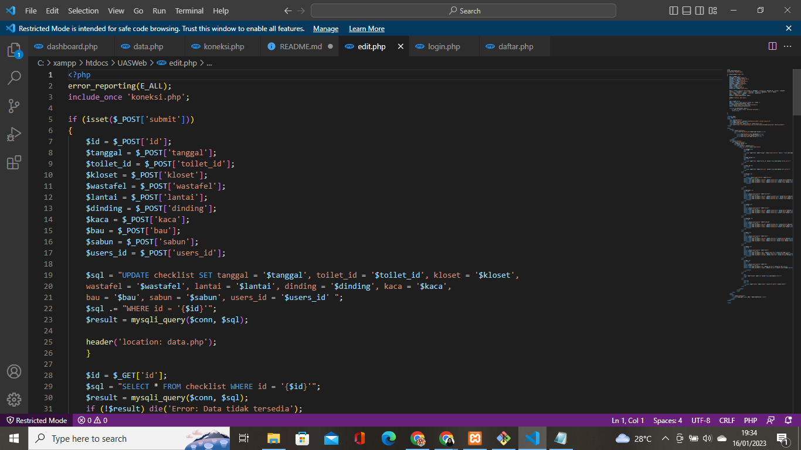
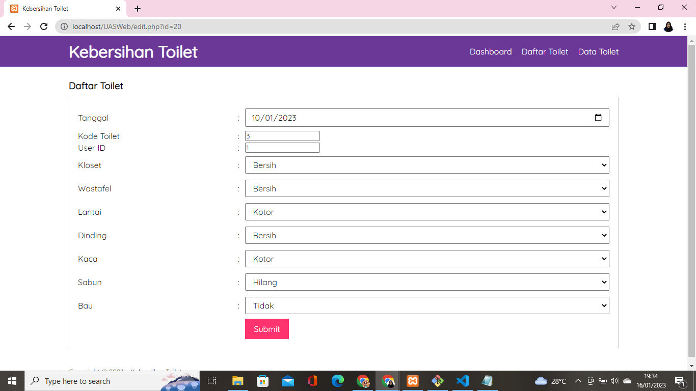

### Hapus
ini adalah kode untuk menghapus data yang sudah kita input:
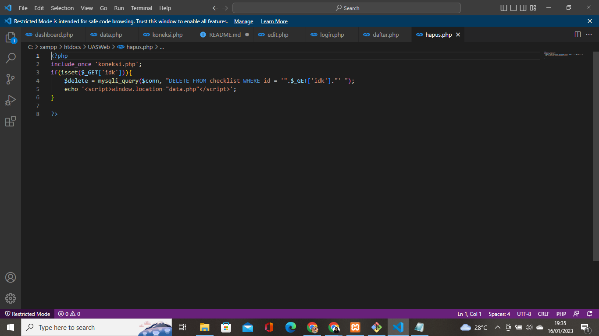
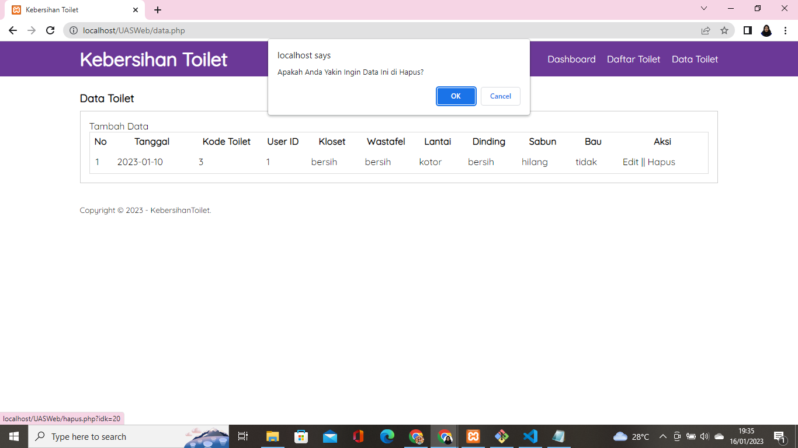

